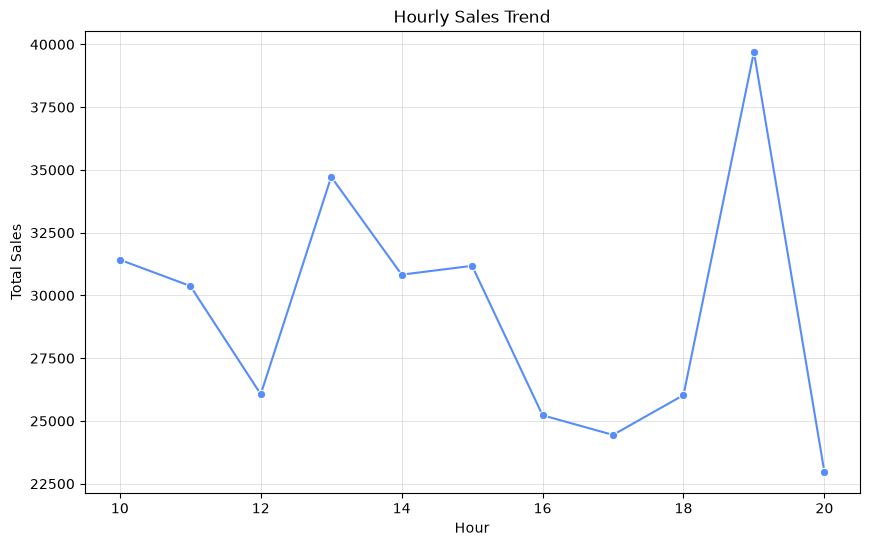
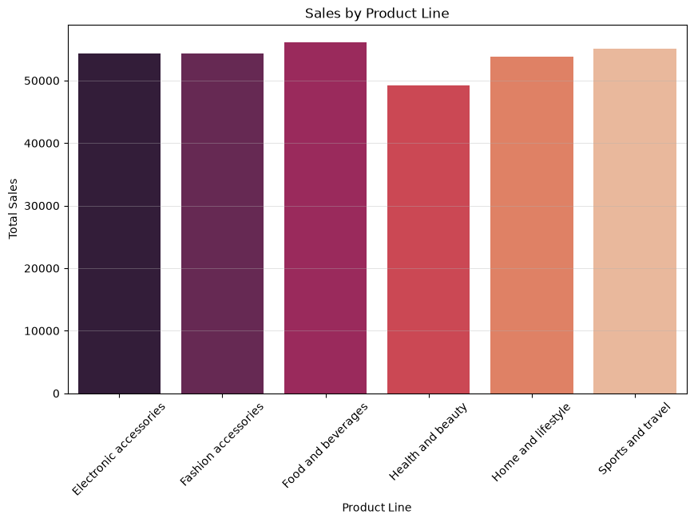
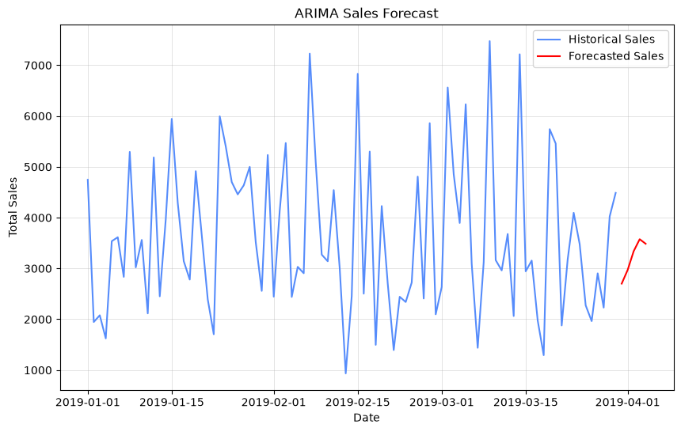

# Supermarket Sales Data Analysis & Forecasting

## Project Overview

This project conducts an end-to-end Exploratory Data Analysis (EDA) and time-series forecasting on supermarket transaction data. The objective is to extract actionable business insights regarding customer purchasing behavior, branch performance, and product profitability, providing data-driven recommendations for promotional strategies and inventory optimization.

## Dataset Source

| Item | Details |
| --- | --- |
| **Dataset Name** | Supermarket Sales Dataset |
| **Source URL** | [[https://www.kaggle.com/datasets/faresashraf1001/supermarket-sales/data]](https://www.kaggle.com/datasets/faresashraf1001/supermarket-sales/data])([https://www.kaggle.com/datasets/faresashraf1001/supermarket-sales/data](https://www.kaggle.com/datasets/faresashraf1001/supermarket-sales/data)) |
| **Author** | Fares Ashraf |
| **License** | Apache 2.0 |

## Dataset Description

The dataset comprises 17 core fields, enabling multi-dimensional business analysis:

| Field Name | Data Type | Business Meaning & Analytical Value |
| --- | --- | --- |
| **Invoice ID** | String | Unique identifier for each transaction. |
| **Branch / City** | Categorical | Store location codes for regional performance comparison. |
| **Customer type** | Categorical | Member vs. Normal customer, useful for customer segmentation. |
| **Product line** | Categorical | Product category for product performance evaluation. |
| **Total** | Float | Total transaction amount including tax (core revenue metric). |
| **Date / Time** | Date/Time | Transaction timestamp for time-series trend and peak-hour analysis. |
| **Payment** | Categorical | Payment method for consumer preference analysis. |
| **COGS / Gross margin %** | Float | Cost of Goods Sold & Profit margin, indicating product profitability. |
| **Rating** | Float | Customer satisfaction score (1-5 scale) for service evaluation. |

## Tech Stack

- **Python 3.12.1**: Core programming language.
- **Pandas**: Data cleaning, transformation, and group-by aggregation.
- **Matplotlib / Seaborn**: Data visualization and charting.
- **Statsmodels (ARIMA)**: Time-series forecasting for future sales prediction.

## Quick Start

1. Ensure `supermarket_sales.csv` is placed in the root directory.
2. Install dependencies: `pip install pandas matplotlib seaborn statsmodels`
3. Run the analysis script: `python main.py`

## Project Documentation

- `Supermarket_Sales_Report.docx`: Detailed business analysis report (in Chinese).
- `Presentation.pptx`: Project presentation slides (in Chinese). *Note: Layout utilizes a free open-source template for educational purposes.*

## Chart Showcase

Below are some key visualizations generated during the analysis:

### Sales Trend by Hour

### Sales Performance by Product Line

### ARIMA Sales Forecast

